# ADR: OAB MCP Adapter MVP - Gmail and Notion

- **Status:** Proposed
- **Date:** 2026-07-24
- **Author:** chaodu-agent

## 1. Context and Problem Statement

OpenAB already has a native MCP client in `openab-agent`. It supports local stdio
servers and remote Streamable HTTP servers, OAuth, lazy connection, a
progressive-disclosure `mcp` meta-tool for direct agent use, and
configuration-driven activation. Those decisions are recorded in
[`openab-agent-mcp.md`](./openab-agent-mcp.md).

What is missing is a small, explicit product and integration boundary for
first-party supported external services. Without that boundary, every service
becomes an ad-hoc `mcp.json` entry, authentication and tool-safety expectations
are unclear, and reviewers cannot distinguish an OAB adapter from a generic
third-party MCP server.

This ADR defines **OAB MCP Adapter** as an outbound agent capability adapter behind an OAB-hosted MCP facade. The facade gives a coding agent one stable, OpenWork-style surface:

- `search_capabilities`
- `execute_capability`

OAB then discovers and invokes tools on configured external MCP servers. The MVP supports:

- **Notion** via Notion's hosted MCP server.
- **Gmail** via Google's hosted Gmail MCP server, currently a Developer Preview
  and therefore explicitly opt-in and preview-labelled.

This is not a proposal to add a second outbound MCP client. It adds the
agent-facing facade boundary while reusing the existing `openab-agent` MCP
runtime for downstream connections. It also does not add native Gmail/Notion
REST adapters.

## 2. Goals and Non-Goals

### Goals

- Give OAB a named, documented **MCP adapter** comparable to other OAB
  integrations, with a stable agent-facing MCP facade.
- Expose exactly two facade tools to the connected agent:
  - `search_capabilities`: discover authorized capabilities from configured
    external MCP servers.
  - `execute_capability`: execute an exact capability returned by discovery.
- Define the OAB Agent capability-access vision inspired by OpenWork: authorized
  services such as Gmail, Calendar, Drive, Slack, Notion, and Linear should be
  reachable through one OAB facade as their provider paths mature.
- Provide an extension point for services without a hosted MCP server: a
  capability plugin/native adapter can use a provider API or SDK while exposing
  the same facade contract. Plugin implementations are outside this MVP.
- Preserve progressive disclosure: provider tools are not flattened into the
  agent's top-level tool list.
- Reuse the existing MCP OAuth, PKCE, credential storage, timeout, redaction,
  circuit-breaker, and tool-filter mechanisms for downstream connections.
- Make least-privilege and write safety explicit:
  - Notion read tools are the default MVP surface; page/database mutations are
    explicit opt-in tools.
  - Gmail search/read and draft creation are supported; direct send and delete
    are not part of the MVP surface.
- Keep existing deployments unchanged when the MCP facade and no MCP adapters
  are configured.

### Non-goals

- Exposing every provider tool directly to the agent or copying provider-specific
  MCP schemas into a second public tool surface.
- Replacing OBK for GitHub, AWS, Discord, or other integrations already owned by
  OBK.
- Implementing a native Gmail or Notion REST/API adapter as part of this MVP.
- Supporting legacy HTTP+SSE when the provider offers Streamable HTTP.
- Providing organization-wide credential management or a multi-tenant control
  plane. This MVP assumes a configured OAB instance and its existing auth
  boundary.
- Automatically enabling Gmail's Developer Preview endpoint in existing or new
  deployments without explicit configuration.

## 3. At a Glance

```mermaid
flowchart TD
    subgraph OAB_POD [OAB Pod - deployment boundary]
        A["Coding CLI / Agent<br/>MCP client"]

        subgraph OAB_RUNTIME [OAB-owned runtime]
            F["OAB MCP Facade<br/>search_capabilities<br/>execute_capability"]
            D["Capability Dispatcher<br/>auth - policy - catalog - audit"]
            M["Hosted MCP Adapter<br/>outbound MCP client<br/>OAuth - tools/list - tools/call"]
            P["Capability Plugin / Native Adapter<br/>provider API or SDK"]

            F --> D
            D --> M
            D --> P
        end

        A -->|MCP| F
    end

    N["Notion hosted MCP<br/>external provider"]
    G["Gmail hosted MCP<br/>external provider - Developer Preview"]
    X["External service without hosted MCP<br/>provider API or SDK"]

    M --> N
    M --> G
    P --> X

    style OAB_POD fill:#0b1220,stroke:#60a5fa,stroke-width:3px
    style OAB_RUNTIME fill:#111827,stroke:#f59e0b,stroke-width:3px
    style P stroke-dasharray: 5 5
    style X stroke-dasharray: 5 5
```



The **OAB Pod** is the outer deployment boundary. It contains both the Coding
CLI/Agent MCP client and the inner **OAB-owned runtime** boundary. The inner
runtime contains the OAB MCP Facade, dispatcher, hosted MCP adapter, and
capability-plugin runtime. Notion, Gmail, and provider APIs remain outside the
OAB Pod; only the outbound adapter or plugin crosses that boundary under OAB
policy and audit controls.

The facade exposes the same two-method contract regardless of the downstream
path. Notion and Gmail use the hosted MCP adapter in this MVP. The dashed
capability-plugin path is the extension point for services that do not provide
a hosted MCP server. It is not a second agent-facing API. The broker serves
the facade in-process as a loopback-only Streamable HTTP endpoint
(`http://127.0.0.1:<port>/mcp`), enabled by the `[mcp]` section in
`config.toml` (§6.2); any coding CLI on the host connects to that URL. The
native `openab-agent` dispatches in-process.

## 4. Terminology and Positioning

- **OAB MCP** is the user-facing feature name.
- **OAB MCP Facade** is the inbound, agent-facing MCP server surface.
- **OAB MCP Adapter** is the outbound component that connects OAB to one or
  more hosted external MCP servers.
- **Capability Plugin / Native Adapter** is an OAB-side provider integration
  that uses a provider API or SDK when no hosted MCP server is available. It
  is an implementation path behind the same facade, not a new agent-facing
  contract.
- **MCP server instance** is one configured provider connection, such as
  `notion` or `gmail`.
- **Capability** is the OAB-facing, searchable representation of an authorized
  provider tool.
- **`search_capabilities`** and **`execute_capability`** are the only facade
  methods exposed to the connected agent in the MVP.

MCP is an agent capability adapter, not a channel adapter and not an Ambient
activation mode. Ambient decides when an agent is prompted; the OAB MCP facade
and adapter decide how that agent reaches authorized external capabilities.

### 4.1 Positioning relative to octobroker (OBK): a two-tier adoption ladder

OpenAB develops two MCP-facing products. They are not competitors and not
redundant; they answer different questions at different deployment scales, and
they compose:

- **OAB MCP Facade (this ADR)** is **pod-level**, for a single OAB's own use.
  It answers *"what can the connected coding CLI discover and use?"* —
  presentation, capability search, catalog caching, and `tool_filter`
  least-privilege hygiene. Its credentials are **personal OAuth grants** (the
  user authorizing access to their own Gmail, their own Notion), held in the
  pod's `auth.json`. For a single-OAB user this is the complete, standalone
  product: no extra deployment, the pod boundary is the trust boundary.
- **octobroker (OBK)** is **fleet-level**, shared by many OABs with distinct
  identities. It answers *"who is allowed to execute what?"* — per-agent
  authentication (`X-Octobroker-Key`), default-deny tool and resource policy,
  short-lived scoped credential minting for **organization-owned** resources,
  and fail-closed audit. A single-OAB deployment does not need it; adopting it
  buys governance at the cost of an extra service.

| | OAB MCP Facade | octobroker (OBK) |
|---|---|---|
| Tier | Pod (one OAB, its own use) | Fleet (many OABs, distinct identities) |
| Question answered | What can the CLI discover and use? | Who may execute what? |
| Credentials | Personal OAuth (user's own resources) | Organization credentials (short-lived, scoped, minted centrally) |
| Trust boundary | Pod / host (loopback) | Network + per-agent key + fail-closed audit |
| When to skip | Never — it is the agent-facing entry point | Single OAB, no org-owned resources: pure added complexity |

Credential ownership follows **resource ownership**, not product tier: personal
resources (the user's Gmail or Notion) are authorized via OAuth and their
tokens correctly live in the facade's `auth.json` — this is the end state, not
a transitional one. Organization resources (org GitHub repositories, a company
Notion workspace) belong behind OBK, so no organization credential ever resides
in an agent pod.

The upgrade path between tiers is a configuration change, not an agent change:
a fleet deployment adds OBK as one more downstream entry in the facade's
`mcp.json`. The agent-facing surface remains exactly
`search_capabilities`/`execute_capability`; because the facade dispatches
native `tools/call` requests to downstreams, OBK's per-tool policy and audit
see real tool names and are never blinded by the meta-tool envelope. Two
disciplines preserve this ladder:

1. No facade feature may assume OBK exists (the single-OAB tier must remain
   complete on its own).
2. No OBK feature may assume the caller is the facade (directly connected MCP
   clients are first-class in the fleet tier).

Consequently, requests to add per-agent keys or fleet policy to the facade, or
personal-OAuth stores to OBK, are out of scope by construction for the
respective product.

## 5. Prior Art and Industry Research

### 5.1 Existing OpenAB MCP client

[`openab-agent-mcp.md`](./openab-agent-mcp.md) establishes the downstream
runtime foundation:

- `openab-agent` is an MCP client, not the agent-facing OAB MCP server.
- `mcpServers` configuration is loaded from global and project
  `.openab/agent/mcp.json` files.
- A configured server is the activation signal; an empty or missing config keeps
  the downstream MCP surface absent.
- Streamable HTTP and stdio are supported, with lazy connection and progressive
  disclosure rather than a flat provider tool list.
- OAuth uses PKCE and persisted credentials, with headless paste-back/device
  flows where the provider supports them.

The OAB MCP facade is the stable inbound boundary for a coding agent. It may use
this existing client/runtime internally for provider discovery and execution;
this ADR does not create a second transport or credential implementation.

### 5.2 OpenWork inspiration and OAB Agent capability vision

OpenWork is the primary product inspiration for the agent-facing boundary. Its
Connect and MCP model demonstrates that an agent can access authorized external
service capabilities through one progressive-discovery surface rather than
requiring every backing coding CLI to define its own provider integration.

The OpenWork capability set provides useful direction for OAB's longer-term
vision:

- Its user-facing Connect services include Gmail, Google Calendar, Google Drive,
  Slack, Notion, and Linear.
- Its hosted MCP connections include services such as Notion, Linear, Stripe,
  Sentry, Exa, Context7, and Slack when the required OAuth app is configured.
- It also supports custom compatible local or remote MCP servers.
- Its native Gmail capability path shows the complementary case where a
  provider is accessed through a first-party API/SDK adapter instead of a
  hosted MCP server.
- Its agent-facing endpoint uses progressive discovery and member-scoped
  authorization instead of exposing every provider tool directly.

OAB adopts the product principle, not a promise of immediate provider parity:
**the OAB Agent should be able to access authorized external capabilities such
as these through the OAB MCP Facade**, regardless of whether the implementation
behind the facade is a hosted MCP adapter or a capability plugin/native adapter.
The stable agent contract remains `search_capabilities` and
`execute_capability`.

The MVP deliberately starts with Notion and Gmail hosted MCP profiles. Calendar,
Drive, Slack, Linear, Stripe, Sentry, Exa, Context7, and other services are
roadmap candidates that can be added through the same facade and provider path
after their auth, safety, availability, and operational requirements are
reviewed. OAB does not copy OpenWork's Den control plane or claim those services
are implemented by this ADR.

References: [OpenWork agent MCP](https://github.com/different-ai/openwork/blob/dev/ee/apps/den-api/src/mcp/agent.ts),
[OpenWork external capabilities](https://github.com/different-ai/openwork/blob/dev/ee/apps/den-api/src/mcp/external-capabilities.ts),
[OpenWork Google Workspace routes](https://github.com/different-ai/openwork/blob/dev/ee/apps/den-api/src/routes/org/google-workspace.ts),
[OpenWork Connect services](https://openworklabs.com/docs/start-here/connect-your-stack/connect-services),
[OpenWork shared MCP connections](https://openworklabs.com/docs/cloud/share-with-your-team/shared-mcp-connections).

### 5.3 OpenWorker native connector prior art

[OpenWorker](https://github.com/andrewyng/openworker) provides complementary
prior art for the capability-plugin path. It is a local-first desktop app with
a local Python agent server, a connector registry, native provider tools, and
optional remote MCP support. Its architecture shows that an agent product can
support provider-maintained MCP and native API/SDK connectors without forcing
every integration through MCP.

The Gmail implementation is a native REST connector rather than a hosted MCP
connection:

- `gmail_search_messages` calls the Gmail REST messages endpoint with an OAuth
  bearer token.
- `gmail_get_message` fetches a message resource directly from Gmail.
- `gmail_send_email` posts a base64url-encoded MIME message to Gmail and is
  approval-gated.
- `gmail:account:<email>` profiles support multiple mailboxes, managed token
  refresh, a default-account pointer, and account-level privacy filters.
- A separate generic Email connector uses IMAP/SMTP and app passwords for
  Gmail, iCloud, Fastmail, and custom providers; it is not the native Gmail
  API path.

OAB adopts the lessons, not OpenWorker's provider-specific agent surface:

- keep connector descriptors/catalog metadata separate from auth/session state;
- enforce provider privacy filters before content reaches the agent;
- make write/send capabilities explicitly approval-gated;
- use a Capability Plugin / Native Adapter when a provider has no hosted MCP;
- allow generic MCP and native connectors to coexist under one policy boundary.

OAB deliberately normalizes these paths behind `search_capabilities` and
`execute_capability` rather than exposing tools such as
`gmail_search_messages` directly. OpenWorker's generic MCP OAuth path is also
useful prior art, but the inspected Gmail implementation uses direct Gmail REST
calls, not Google's hosted Gmail MCP endpoint.

References: [OpenWorker README](https://github.com/andrewyng/openworker),
[OpenWorker Gmail tools](https://github.com/andrewyng/openworker/blob/main/coworker/connectors/integration_tools.py),
[OpenWorker Gmail accounts](https://github.com/andrewyng/openworker/blob/main/coworker/connectors/gmail_accounts.py),
[OpenWorker generic email connector](https://github.com/andrewyng/openworker/blob/main/coworker/connectors/email_tools.py),
[OpenWorker MCP OAuth](https://github.com/andrewyng/openworker/blob/main/coworker/mcp/oauth.py).

### 5.4 Notion hosted MCP

Notion provides a first-party hosted MCP server at
`https://mcp.notion.com/mcp`, using Streamable HTTP and user OAuth. Its tools
are intentionally agent-oriented rather than a one-to-one dump of REST
endpoints. The documented surface includes search, fetch, page create/update,
comments, database queries, and async task status.

Notion's official guidance also states that hosted MCP requires user-based OAuth
and does not support bearer-token authentication for headless service use. This
makes it a good MVP remote connector, but an operator must complete an
interactive login for each configured account.

References: [Notion connection guide](https://developers.notion.com/guides/mcp/get-started-with-mcp),
[Notion supported tools](https://developers.notion.com/guides/mcp/mcp-supported-tools),
[Notion hosted MCP design](https://www.notion.com/blog/notions-hosted-mcp-server-an-inside-look).

### 5.5 Gmail hosted MCP

Google provides `https://gmailmcp.googleapis.com/mcp/v1` as a Gmail remote MCP
server. The official documentation currently labels it **Developer Preview**.
The documented setup enables Gmail API and Gmail MCP API, configures OAuth, and
requests `gmail.readonly` and `gmail.compose`. The documented tools include
thread/message search and retrieval, labels, and draft creation.

Because the service is preview-only, Gmail support is an explicit opt-in profile
in this MVP. Direct sending and deletion are not exposed by the OAB profile.
A future native Gmail adapter remains possible if the hosted MCP contract is
not stable enough for production.

Reference: [Google Gmail MCP setup](https://developers.google.com/workspace/gmail/api/guides/configure-mcp-server).

### 5.6 OpenClaw and Hermes Agent

The repository contribution guidelines require OpenClaw and Hermes Agent as
prior art for runtime integrations.

- **OpenClaw** is primarily a multi-channel gateway. Its MCP work is useful for
  configuration and channel-to-tool bridging, but it is not a direct model for
  the native `openab-agent` client. OAB therefore keeps channel adapters and
  the outbound MCP adapter as separate layers.
- **Hermes Agent** provides relevant MCP lifecycle patterns: per-server state,
  OAuth handling, failure isolation, and circuit breaking. OAB already has
  equivalent foundations in `openab-agent`; this MVP adds no second lifecycle
  manager.

References: [OpenClaw](https://github.com/openclaw/openclaw),
[Hermes Agent MCP implementation](https://github.com/NousResearch/hermes-agent).

## 6. Proposed Solution

### 6.1 Facade and adapter boundary

The OAB MCP facade is the inbound MCP server exposed to the coding agent. It
owns the stable public contract and delegates provider work to a shared
capability dispatcher:

```text
OAB Pod (outer deployment boundary)
  +-- Coding CLI / Agent (MCP client)
  +-- OAB-owned runtime (inner boundary)
        +-- OAB MCP Facade (MCP server)
              +-- search_capabilities(query)
              +-- execute_capability(name, arguments)
                    +-- Capability Dispatcher
                          +-- Hosted MCP Adapter (MCP client)
                          |     +-- notion -> hosted MCP + OAuth
                          |     +-- gmail  -> hosted MCP + OAuth (preview)
                          +-- Capability Plugin / Native Adapter
                                +-- provider API or SDK
```

The facade owns:

- agent authentication and request authorization;
- capability search over the configured, policy-filtered catalog;
- stable capability names, schemas, availability, risk metadata, and provider
  identity;
- validation that execution uses an exact capability returned by discovery;
- redacted results, errors, and audit records.

The hosted MCP adapter owns connection concerns only:

- endpoint and transport selection;
- OAuth discovery, PKCE, login, refresh, and credential namespace;
- `tools/list` and tool-schema caching;
- configured include/exclude tool filters;
- timeout, cancellation, circuit breaker, and redacted errors;
- dispatch of exact provider tool names and arguments.

A capability plugin/native adapter implements the same catalog and execution
interface using a provider API or SDK. It is the fallback path for services
without a hosted MCP server and must use the same OAB authorization, schema,
policy, confirmation, redaction, and audit controls. Plugin implementations are
not part of the Notion/Gmail hosted-MCP MVP unless separately enabled and
reviewed.

Hosted MCP provider business logic remains at the provider MCP server. A future
plugin may contain a thin provider API/SDK translation layer, but the facade
must not expose provider-specific APIs directly to the agent.

### 6.2 Facade transport and registration

The facade is a **loopback-only Streamable HTTP** MCP server hosted
**in-process by the OAB broker**, activated by the presence of an `[mcp]`
section in the broker's `config.toml`:

```toml
[mcp]
listen = "127.0.0.1:8848"   # loopback only; this is the default
```

- **External coding CLIs (Kiro, Claude Code, Codex, ...):** connect to
  `http://127.0.0.1:<port>/mcp` like any remote MCP server. Because the
  endpoint is plain Streamable HTTP, every MCP-capable CLI on the host can
  use the facade with its normal remote-server configuration — no
  CLI-specific registration format, no OAB-managed subprocess.
- **Runtime sharing:** the MCP runtime (connections, OAuth, credential store,
  tool filters, circuit breaker, schema validation) is extracted into the
  shared `crates/openab-mcp` crate. The broker links it directly to serve the
  facade; `openab-agent` re-exports the same crate. One implementation, two
  hosts — no duplicated runtime, which this ADR forbids.
- **Security posture:** the listener refuses to bind any non-loopback
  address; the endpoint itself carries no authentication layer,
  so the host/pod boundary is the trust boundary for every capability that
  does not require a session. Deployments that colocate untrusted processes
  must not enable `[mcp]`. Session-bound sources are the exception: the
  per-session bearer shipped in #1447, so the facade hides and refuses them
  unless the request resolves to a session. A socket-permission scheme for
  the remaining session-free capabilities is still a documented follow-up.
- **Native `openab-agent`:** the dispatcher is invoked in-process via the
  existing `mcp` meta-tool. No HTTP hop is required because the facade
  contract and policy checks are implemented by the same dispatcher component
  (see §6.4).
- **ACP `session/new` `mcpServers` advertisement** (OAB injecting the facade
  URL into the agent session it spawns) is a follow-up on top of this
  transport, not a prerequisite: the loopback URL is already reachable by any
  CLI the operator points at it.

This is the same architectural role that
[`acp-server-websocket-reverse-mcp.md`](./acp-server-websocket-reverse-mcp.md)
assigns to OpenAB core: an MCP proxy/aggregator between the agent and upstream
capability sources, delivered to the agent via `mcpServers`. The OAB MCP Facade
is that inbound component for external service capabilities; browser tools and
external capabilities share the delivery mechanism, and Alternative C's
rejection of a "second generic inbound MCP server" means no additional
agent-facing MCP server beyond this one aggregation point.

If a backing CLI does not honor ACP `mcpServers`, the facade is unavailable for
that CLI in the MVP rather than falling back to editing the CLI's config files.

### 6.3 Configuration and activation

Keep the existing `openab-agent` configuration contract rather than introducing
a duplicate top-level TOML section:

- global: `~/.openab/agent/mcp.json`;
- project: `.openab/agent/mcp.json`;
- project entries override global entries with the same server name;
- no configured adapter servers means the facade has no provider capabilities;
- declaring a server is the explicit opt-in activation signal.

The existing file remains the source of truth for downstream provider
connections. The facade is the agent-facing source of truth for the two-method
contract; it does not inject provider tools into the agent's top-level tool
list.

Illustrative configuration:

```json
{
  "mcpServers": {
    "notion": {
      "type": "http",
      "url": "https://mcp.notion.com/mcp",
      "oauth": {
        "discovery": true,
        "discovery_allowlist": ["*.notion.com"]
      },
      "tool_filter": {
        "include": [
          "notion-search",
          "notion-fetch",
          "notion-get-async-task"
        ]
      }
    },
    "gmail": {
      "type": "http",
      "url": "https://gmailmcp.googleapis.com/mcp/v1",
      "oauth": {
        "discovery": true,
        "discovery_allowlist": ["*.google.com", "*.googleapis.com"],
        "scopes": [
          "https://www.googleapis.com/auth/gmail.readonly",
          "https://www.googleapis.com/auth/gmail.compose"
        ]
      },
      "tool_filter": {
        "include": [
          "search_threads",
          "get_thread",
          "get_message",
          "create_draft"
        ]
      }
    }
  }
}
```

The exact OAuth client registration fields remain deployment/provider-specific.
They must not be committed with credentials. If a provider requires a
pre-registered client, operators use the existing `oauth.client_id`,
`oauth.client_secret`, and environment interpolation facilities.

The profile examples are deliberately conservative. A deployment may add
provider tools after reviewing their schemas and side effects.

### 6.4 Capability discovery and execution

The facade exposes only two stable methods. Provider-specific tools remain
behind the adapter and are represented as searchable capabilities:

```text
search_capabilities({"query":"find recent project notes"})
  -> {
      "capabilities": [{
        "name": "notion-search",
        "description": "Search authorized Notion content",
        "input_schema": {"...": "provider-declared JSON Schema"},
        "provider": "notion",
        "risk": "read",
        "availability": "ready"
      }]
    }

execute_capability({
  "name": "notion-search",
  "arguments": {"query":"project notes"}
})
  -> provider CallToolResult (redacted and policy-checked)
```

`search_capabilities` returns only configured, authorized, policy-allowed
capabilities and their provider-declared schemas. `execute_capability` accepts
only an exact capability name and schema returned by discovery; it validates
arguments before dispatching the corresponding downstream `tools/call`.

A downstream MCP `tools/list_changed` notification invalidates the relevant
capability cache. The facade must then refresh discovery before accepting a
call whose schema or availability may have changed. Provider names and raw
provider credentials are never required in the agent-facing contract.

#### Relationship to the existing `mcp` meta-tool

`openab-agent` already exposes an LLM-facing `mcp` meta-tool with six actions
(`help`, `list_servers`, `list_tools`, `describe_tool`, `call`, `status`)
implemented in `openab-agent/src/mcp/meta_tool.rs`. The facade does not add a
second discovery/execution surface on top of it:

- The meta-tool and the facade are two frontends over the **same capability
  dispatcher and MCP runtime**. Catalog contents, tool filters, policy checks,
  schema validation, and audit behavior are identical regardless of frontend.
- No agent runtime sees both surfaces. The native `openab-agent` keeps the
  in-process meta-tool; an external coding CLI receives only the facade via
  ACP `mcpServers` (§6.2) and never sees the meta-tool, which is internal to
  `openab-agent`.
- The meta-tool's action vocabulary is unchanged by this MVP. Converging its
  action names with `search_capabilities`/`execute_capability` is a documented
  follow-up, not an MVP requirement, because renaming the accepted meta-tool
  contract would be a breaking change to
  [`openab-agent-mcp.md`](./openab-agent-mcp.md).

### 6.5 MVP capability profiles

#### Notion

- Stable hosted endpoint: `https://mcp.notion.com/mcp`.
- User OAuth; each configured account is authorized by a human.
- Default profile: search, fetch, and async-status read operations.
- Page/database/comment mutations require an explicit tool-filter change and
  normal confirmation policy.
- File upload is out of scope because Notion's hosted MCP documentation does
  not currently support it.

#### Gmail

- Hosted endpoint: `https://gmailmcp.googleapis.com/mcp/v1`.
- Developer Preview; disabled unless explicitly configured.
- OAuth scopes limited to `gmail.readonly` and `gmail.compose`.
- MVP profile: search/read threads and messages, plus create drafts.
- Direct send, permanent delete, settings changes, and unrestricted mailbox
  mutation are out of scope.
- Draft results must be presented as drafts for user review; the adapter must
  not claim that a message was sent.

### 6.6 Credential and session model

- HTTP MCP servers use the existing `openab-agent` OAuth manager and
  namespaced credential store (`mcp:<server-name>`).
- Refresh tokens remain on OAB's protected persistent filesystem and are never
  sent through chat, inserted into prompts, or written to logs.
- The existing headless login flow is used for remote servers: device flow when
  advertised, otherwise PKCE paste-back flow.
- A server is connected lazily on first discovery or execution; one failing
  server must not prevent the facade from starting or using another server.
- Existing per-server timeout, cancellation, idle eviction, and circuit breaker
  behavior applies without an adapter-specific retry loop.

### 6.7 Safety policy

The adapter treats remote content as untrusted data:

- Email bodies, Notion pages, comments, and search results must never be
  interpreted as OAB system instructions.
- Read-only tools are preferred for the default profile.
- Mutation tools require explicit configuration and must preserve the provider's
  own authorization checks.
- Gmail `create_draft` is the only write-like Gmail operation in the MVP; no
  send capability is enabled.
- Tool arguments are validated against provider-declared schemas before call.
- Provider URLs and OAuth discovery are restricted to HTTPS and explicit
  allowlists according to the existing MCP config validation.
- Stdio servers continue to use the existing environment scrubbing; the adapter
  must not pass OAB channel tokens or unrelated secrets to child processes.
- Errors returned through the facade and written to audit logs remain redacted;
  downstream provider details are not treated as agent instructions.

## 7. Why This Approach

This approach keeps one small, stable agent-facing contract while allowing OAB
to support both provider-owned MCP and providers that expose only an API or SDK:

- Notion already provides a production-oriented hosted MCP server and
  agent-friendly tools; duplicating its REST API would create maintenance and
  schema drift.
- Gmail's official server is available for an opt-in preview integration. The
  profile makes its preview status and limited scopes visible instead of hiding
  the risk behind a native adapter.
- A capability plugin/native adapter provides a controlled fallback for a
  service without hosted MCP, without changing the agent's discovery or
  execution methods. The plugin path carries extra provider-client maintenance
  and is explicitly not part of this MVP.
- Reusing the existing MCP client avoids a second outbound OAuth store,
  transport stack, or server lifecycle implementation.
- The two-method facade, shared dispatcher, tool filtering, and progressive
  discovery prevent the model context from being flooded with provider tools
  and create an explicit safety boundary.
- Existing deployments are unchanged: no `mcp.json` means no hosted MCP runtime
  and no new network calls.

The trade-off is dependency on provider MCP availability, OAuth behavior, and
remote tool-schema stability. Those risks are acceptable for Notion and for an
explicitly preview-labelled Gmail profile; they are not acceptable grounds for
silently enabling either provider.

## 8. Alternatives Considered

### A. Add native Gmail and Notion REST adapters

Rejected for this MVP. It duplicates provider API clients, OAuth scope mapping,
response normalization, and rate-limit behavior already implemented by the
providers. It remains a possible Gmail follow-up if Google's hosted MCP stays
preview-only or lacks required production controls.

### B. Let each backing coding CLI configure Notion/Gmail directly

Rejected as the OAB default. It produces different auth, tool filtering,
credential persistence, and diagnostics for each CLI. It can remain a manual
escape hatch for operators who intentionally configure a server outside OAB.

### C. Add a second generic inbound MCP server

Rejected as unnecessary for this MVP. The OAB MCP facade is the intentionally
scoped inbound server for the coding agent, filling the MCP proxy/aggregator
role that [`acp-server-websocket-reverse-mcp.md`](./acp-server-websocket-reverse-mcp.md)
already assigns to OpenAB core (§6.2). A separate generic server for
arbitrary OAB workflows would require another authentication, tenancy, and
authorization design and would blur the two-method capability boundary.

### D. Flatten all provider tools into the agent's top-level tool list

Rejected. The facade exposes only `search_capabilities` and
`execute_capability`; lazy discovery preserves the agent's small prompt and
isolates provider schema drift. This follows the accepted progressive-disclosure
pattern rather than flattening downstream tools.

### E. Duplicate provider configuration in a top-level `[mcp]` TOML section

Rejected: `openab-agent` already owns and documents layered
`.openab/agent/mcp.json` configuration, and that file remains the only source
of provider connections. The broker's `[mcp]` section (§6.2) is deliberately
**not** a second provider registry — it carries only facade-listener settings
(`listen`), and its presence is the opt-in switch for serving the facade.

## 9. Risks and Mitigations

| Risk | Impact | Mitigation |
|---|---|---|
| Gmail hosted MCP is Developer Preview | Contract or availability changes | Explicit opt-in; preview label; limited tools/scopes; native adapter remains a follow-up |
| OAuth requires a human browser flow | Headless deployment cannot silently connect | Existing paste-back/device flows; actionable `mcp login` instructions; no false ready state |
| Provider tool/schema drift | Calls fail or model guesses stale arguments | Cache invalidation on `tools/list_changed`; exact-name/schema discovery; `mcp doctor` |
| Prompt injection in email/page content | Agent may perform unintended actions | Treat provider data as untrusted; least-privilege filters; no Gmail send/delete |
| Token leakage | Account compromise | PKCE, protected token store, env scrubbing, redacted logs, no credentials in prompts |
| Remote MCP outage/rate limit | Agent task failure or latency | Per-server timeout, circuit breaker, bounded retries, provider error surfaced accurately |
| Excessive provider tool context | Poor tool selection and token cost | Two-method facade, lazy capability search, and include filters |
| Notion/Gmail account mismatch | Wrong mailbox/workspace action | Show server name and auth state; require explicit login per configured server; never infer identity from content |

## 10. Rollout Plan

1. **Documentation/profile slice:** land this ADR and checked-in configuration
   examples; no behavior change for existing deployments.
2. **Notion MVP:** validate OAuth login, discovery, read tools, and one explicit
   page mutation in a controlled test workspace.
3. **Gmail preview MVP:** validate Google OAuth, search/read, and draft creation
   with a test mailbox; keep the profile opt-in and clearly preview-labelled.
4. **Operational hardening:** add provider-specific smoke checks and document
   reconnect, rate-limit, and schema-drift remediation.
5. **Follow-up decision:** decide whether Gmail should remain hosted-MCP based on
   preview stability or move to a native Gmail adapter.

## 11. Validation

### Documentation and configuration

- Verify all relative ADR links resolve from `docs/adr/`.
- Parse the JSON examples and validate that profile fields match the existing
  `openab-agent` MCP config schema.
- Confirm existing configuration with no `mcp.json` remains unchanged.

### Automated checks

- Unit-test config layering and server activation with zero, one, and two
  servers.
- Unit-test include/exclude filters so Gmail send/delete-like tools cannot enter
  the default profile.
- Unit-test OAuth URL/discovery allowlist validation and secret redaction.
- Mock Streamable HTTP `initialize`, `tools/list`, `tools/list_changed`, and
  `tools/call` for both profiles.
- Test one provider failure does not prevent the other provider from connecting.

### Manual integration checks

- Notion: `mcp login notion`, list tools, search/fetch a test page, and verify a
  mutation is blocked until explicitly enabled.
- Gmail: `mcp login gmail`, search a test mailbox, fetch a thread, create a draft,
  and verify no send operation is exposed.
- Run `openab-agent mcp doctor` for each configured server.

The implementation PR must run the repository validation commands required by
`AGENTS.md`:

```bash
cargo fmt --check
cargo check
cargo clippy -- -D warnings
cargo test
```

For this docs-only ADR proposal, no code or Helm behavior changes are expected;
provider smoke tests are acceptance criteria for the follow-up implementation PR.

## 12. Decision Summary

Adopt **OAB MCP Adapter** behind an agent-facing **OAB MCP Facade**. The
facade exposes exactly two stable methods:

- `search_capabilities` for authorized, policy-filtered provider discovery.
- `execute_capability` for schema-validated execution of an exact discovered
  capability.

The adapter uses the existing `openab-agent` MCP client/runtime for hosted MCP
connections. A future capability plugin/native adapter may use a provider API or
SDK for services without hosted MCP, but it must implement the same catalog,
policy, and execution boundary rather than adding agent-facing provider APIs.

The MVP supports:

- Notion hosted MCP with user OAuth and conservative read-first tooling.
- Gmail hosted MCP as an explicit, limited-scope Developer Preview integration
  for search/read and draft creation.

Configuration presence remains the opt-in signal. The MVP does not add a second
MCP runtime, a native Gmail/Notion REST client, or a new TOML source of truth.

## 13. Post-decision status (2026-07-25 addendum)

The design above is recorded as decided; implementation and live validation
overtook parts of §5/§10 before this ADR merged. Decisions themselves are
unchanged — this section records outcomes so the document does not mislead:

- **Facade MVP shipped** (#1448) as specified in §6.2 (broker-hosted loopback
  Streamable HTTP + `openab-mcp` shared crate), including `tool_filter`
  enforcement. **Facade-only run mode** followed (#1453): an adapter-less
  config with `[mcp]` present is a valid `openab run` deployment.
- **Gmail (§5.5/§6.5) resolved ahead of Notion, and native-first**: live
  validation showed the hosted server rejects every `tools/call` without
  Workspace Developer Preview Program enrollment, and the program **rejects
  consumer accounts** — for consumer mailboxes the hosted path is unavailable
  regardless of waiting, and program terms bar pre-GA shipping in public
  applications. The §6.1 Capability Plugin path shipped as the **native
  Gmail adapter** (#1449, `docs/gmail-native.md`): the six-tool §6.5 profile
  over Gmail's GA REST API with tool names/shapes mirroring the hosted
  server, so the §10 step-5 cut-over back to hosted (re-evaluate at GA)
  remains a config-only change. Rollout steps 3/5 are therefore resolved;
  step 2 (Notion) is still pending.
- **Session-aware in-process capability sources** (#1454) extend §6: the
  facade can host provider sources in-process, with per-agent-session
  identity via broker-minted tokens (`Authorization` header → `SessionCtx`).
  Session-bound capabilities (e.g. browser control, the ACP-MCP browser ADR)
  are invisible and unreachable to anonymous clients. This supersedes the
  assumption that all facade capabilities come from `mcp.json` servers.
- **Positioning** (§4.1) and CLI taxonomy (`docs/cli-conventions.md`) were
  adopted as written.
