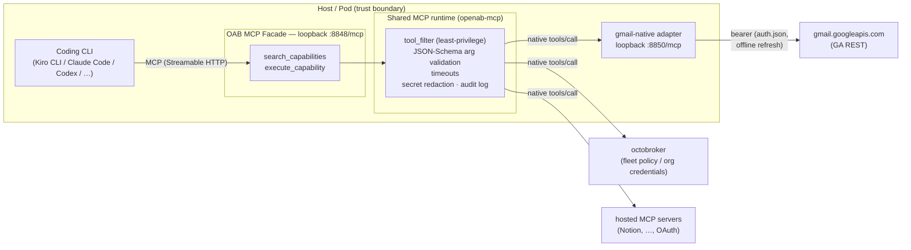

# OAB MCP Facade (`search_capabilities` / `execute_capability`)

The OAB MCP Facade is a loopback Streamable HTTP MCP server that exposes
exactly **two agent-facing tools** — `search_capabilities` and
`execute_capability` — backed by every MCP server configured in `mcp.json`.
Any MCP-capable coding CLI on the host (Kiro CLI, Claude Code, Codex, …)
connects to `http://127.0.0.1:<port>/mcp` and gets progressive discovery over
the whole provider catalog instead of a flat list of every provider tool.

Design: [OAB MCP Adapter ADR](adr/oab-mcp-adapter.md) (§6).

## Architecture



The agent always sees exactly two tools; providers configured in `mcp.json`
are discovered through `search_capabilities` and invoked through
`execute_capability`. Because the runtime dispatches **native** `tools/call`
requests downstream, per-tool policy at any downstream (for example
octobroker's default-deny allowlists) sees real tool names — the meta-tool
envelope never blinds it.

## Two ways to run it

**In-process in the OAB broker** — presence of `[mcp]` in `config.toml`
starts the listener:

```toml
[mcp]
listen = "127.0.0.1:8848"   # loopback only; non-loopback refused at startup
```

**Facade-only run mode** (no chat adapter anywhere — coding-CLI-only
hosts, dev loops, CI runners): an adapter-less config with `[mcp]` present
is a valid deployment; `openab run` serves just the facade listener:

```sh
cat > facade-only.toml <<'TOML'
[mcp]
listen = "127.0.0.1:8848"
TOML
openab run -c facade-only.toml
```

Both read the same layered provider config: `~/.openab/agent/mcp.json`
(global) and `./.openab/agent/mcp.json` (project). No `[mcp]` section / no
configured servers → no listener / an empty capability catalog. Provider
connections stay in `mcp.json` — `[mcp]` carries listener settings only
(single source of truth, ADR Alternative E).

## The two tools

1. `search_capabilities` (optional `query`) — discover authorized provider
   tools: name, description, input schema, provider, availability. Filtered
   by each server's `tool_filter` **before** anything reaches the agent.
2. `execute_capability` (`name` + `arguments`) — execute an exact capability
   returned by discovery. Arguments are validated against the capability's
   JSON Schema before dispatch; timeouts and secret redaction apply on the
   same path the native agent uses.

An audit line is logged for every dispatch (tool name + args SHA-256 — never
plaintext arguments):

```
mcp.audit: mcp call_tool entry server="gmail" tool="search_threads" args_sha256=…
mcp.audit: mcp call_tool exit  server="gmail" tool="search_threads" … outcome="ok"
```

> **`mcp.audit` must be enabled in `RUST_LOG`, or these lines are silently dropped.**
> The audit events use `mcp.audit` as a *bare* tracing target — it is not under the
> `openab` prefix, so a filter like `RUST_LOG=openab=debug,openab_agent=debug` matches
> nothing for them and no audit line is ever emitted. Nothing warns you that auditing
> is effectively off. Name the target explicitly:
>
> ```
> RUST_LOG=openab=debug,openab_agent=debug,mcp.audit=info
> ```
>
> Any filter that raises the global default (`RUST_LOG=info`, `RUST_LOG=debug`, …) also
> emits them.

## Client registration examples

Kiro CLI (`~/.kiro/settings/mcp.json`, or the agent file — see gotcha):

```json
{ "mcpServers": { "oab": { "url": "http://127.0.0.1:8848/mcp" } } }
```

> **Kiro CLI gotcha:** when kiro runs with `--agent <name>` (as OAB bot
> deployments do), the MCP server list comes from
> `~/.kiro/agents/<name>.json` (`mcpServers` + `allowedTools`), **not** the
> global settings file. Register there and allowlist the server
> (e.g. `"@oab"`).

Claude Code:

```sh
claude mcp add --transport http oab http://127.0.0.1:8848/mcp
```

## Trust model

Loopback-only, **no authentication layer** — the host/pod boundary is the
trust boundary. Any process on the host can invoke every capability that does **not** require a session.
Session-bound sources are different: since the per-session bearer shipped, the facade filters
them out unless the request resolves to a session, so a host process without that token can
neither discover nor call them. Do not enable it on hosts that colocate
untrusted processes. Least-privilege is enforced per provider with
`tool_filter` include/exclude lists in `mcp.json`; excluded tools are
invisible to discovery and rejected at execution.

## Positioning vs octobroker (OBK)

The facade is **pod-level**: one agent's own capability access, personal
OAuth credentials, host trust boundary. Fleet-level concerns — per-agent
identity/keys, default-deny policy across many agents, centrally minted
short-lived organization credentials, fail-closed audit — belong to
[octobroker](https://github.com/openabdev/octobroker). The two compose: the
facade can list an octobroker endpoint as one of its `mcp.json` downstreams,
and because the facade dispatches native `tools/call` requests, octobroker's
per-tool policy sees real tool names. See ADR §4.1.

## Providers

Any Streamable HTTP or stdio MCP server configured in `mcp.json` works,
including OAuth-protected hosted servers (login via
`openab-agent mcp login <server>`). For Gmail on consumer accounts, use the
[native Gmail adapter](gmail-native.md).
